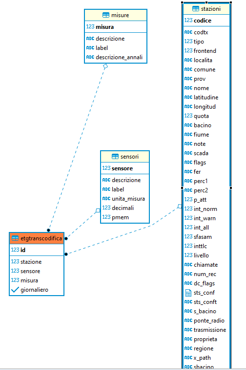

# W7 - Databases

### Index

[TOC]

---

## General

`w7-microservice-db` exclusively manage all the databases I/Os

In `w7-microservice-db/settings/_root.js` there are the databases connections default params (and configurations).

```js
settings.db = {
  own: pg,
  data: { v1: mssql, v2: pg }
}
```

To access to a specific version from other microservices (`api`, `realtime`, `auth`), set the proper url in their own `settings` file  

```js
settings.microservices = {
  db: {
    url: 'http://127.0.0.1:9110/v1'
  }
}
```

or 

```js
settings.microservices = {
  db: {
    url: 'http://127.0.0.1:9110/v2'
  }
}
```

## Architecture


databases and tables

- own (postgres)
  - layers
  - profiles
  - graph_scales
  - users
  - grants
  - users_grants
  - cameras
  - snapshots

- w7 (postgres)
  - sensori
  - misure
  - stazioni
  - dati_correnti
  - etgtranscodifica
  - digitali
  - analog
  - digitin
  - dati_periodici
  - dati_giornalieri
  - stazioni_info
  - allerte
  - zone_allerta
  - stazioni_foto
  - stazioni_memo

- w7 (mssql)
  - Archivio_Allarmi 
  - Archivio_notifiche


## T-SQL

-- Drop table

-- DROP TABLE public."AlertServerLog";

CREATE TABLE public."AlertServerLog" (
	id serial NOT NULL,
	"eventId" varchar(255) NULL,
	"type" enum_AlertServerLog_type NOT NULL,
	message text NULL,
	receiver varchar(255) NULL,
	"receiverName" varchar(255) NULL,
	"receiverSurname" varchar(255) NULL,
	state enum_AlertServerLog_state NOT NULL,
	reason text NULL,
	"createdAt" timestamptz NOT NULL,
	"updatedAt" timestamptz NOT NULL,
	CONSTRAINT "AlertServerLog_pkey" PRIMARY KEY (id)
);

-- Drop table

-- DROP TABLE public.alertlogactions;

CREATE TABLE public.alertlogactions (
	id serial NOT NULL,
	username varchar(255) NULL,
	descrizione text NULL,
	dettagli text NULL,
	"createdAt" timestamptz NOT NULL,
	"updatedAt" timestamptz NOT NULL,
	CONSTRAINT alertlogactions_pkey PRIMARY KEY (id)
);

-- Drop table

-- DROP TABLE public.allerte;

CREATE TABLE public.allerte (
	id serial NOT NULL,
	categorie jsonb NULL,
	"zone" jsonb NULL,
	livello varchar NOT NULL,
	note varchar NOT NULL,
	da timestamp NOT NULL DEFAULT now(),
	a timestamp NOT NULL DEFAULT now(),
	CONSTRAINT allerte_pkey PRIMARY KEY (id)
);

-- Drop table

-- DROP TABLE public.archivio_allarmi;

CREATE TABLE public.archivio_allarmi (
	id serial NOT NULL,
	id_evento varchar(255) NULL,
	id_condizione varchar(255) NULL,
	codice_condizione varchar(255) NULL,
	id_stazione int4 NULL,
	condizione_serializzata text NULL,
	evento enum_archivio_allarmi_evento NULL,
	"createdAt" timestamptz NOT NULL,
	"updatedAt" timestamptz NOT NULL,
	CONSTRAINT archivio_allarmi_pkey PRIMARY KEY (id)
);

-- Drop table

-- DROP TABLE public.codice_fer;

CREATE TABLE public.codice_fer (
	id bigserial NOT NULL,
	codice varchar(3) NULL,
	CONSTRAINT codice_fer_pkey PRIMARY KEY (id)
);

-- Drop table

-- DROP TABLE public.configuration_history;

CREATE TABLE public.configuration_history (
	id bigserial NOT NULL,
	"data" timestamp NULL,
	note varchar NULL,
	username varchar NULL,
	"method" varchar NULL,
	"userId" int4 NULL,
	value_mod varchar NULL,
	CONSTRAINT configuration_history_pkey PRIMARY KEY (id)
);

-- Drop table

-- DROP TABLE public.configurazioni;

CREATE TABLE public.configurazioni (
	id serial NOT NULL,
	"name" varchar NOT NULL,
	configurazione jsonb NULL,
	abilitato bool NOT NULL,
	tipologia varchar NOT NULL,
	CONSTRAINT configurazioni_pkey PRIMARY KEY (id)
);

-- Drop table

-- DROP TABLE public.contatti;

CREATE TABLE public.contatti (
	id serial NOT NULL,
	nome varchar(255) NULL,
	cognome varchar(255) NULL,
	username varchar(255) NULL,
	numero_voce varchar(255) NULL,
	numero_sms varchar(255) NULL,
	email varchar(255) NULL,
	codice_sblocco varchar(255) NULL,
	notifiche_enabled bool NOT NULL DEFAULT true,
	mod_reperibilita enum_contatti_mod_reperibilita NULL,
	CONSTRAINT contatti_pkey PRIMARY KEY (id)
);

-- Drop table

-- DROP TABLE public.dataexchange_logs;

CREATE TABLE public.dataexchange_logs (
	id bigserial NOT NULL,
	"data" timestamp NOT NULL,
	log varchar NULL,
	CONSTRAINT dataexchange_logs_pkey PRIMARY KEY (id)
);

-- Drop table

-- DROP TABLE public.dati_inviati_flags;

CREATE TABLE public.dati_inviati_flags (
	"Id" serial NOT NULL,
	fbit int2 NOT NULL,
	"type" varchar(3) NOT NULL,
	descrizione varchar(255) NULL,
	CONSTRAINT dati_inviati_flags_pkey PRIMARY KEY ("Id")
);

-- Drop table

-- DROP TABLE public.digitali;

CREATE TABLE public.digitali (
	id_digital int4 NOT NULL,
	allarmi int4 NULL,
	descrizione varchar(60) NULL,
	CONSTRAINT digitale_pkey PRIMARY KEY (id_digital)
);

-- Drop table

-- DROP TABLE public.fer;

CREATE TABLE public.fer (
	codice varchar(3) NOT NULL,
	flags varchar(4) NULL,
	master bool NOT NULL,
	nome varchar(255) NULL,
	CONSTRAINT fer_pkey PRIMARY KEY (codice)
);

-- Drop table

-- DROP TABLE public.ferm;

CREATE TABLE public.ferm (
	codice varchar(3) NOT NULL,
	flags varchar(4) NULL,
	master bool NOT NULL,
	nome varchar(255) NULL,
	CONSTRAINT ferm_pkey PRIMARY KEY (codice)
);

-- Drop table

-- DROP TABLE public.fers;

CREATE TABLE public.fers (
	codice varchar(3) NOT NULL,
	flags varchar(4) NULL,
	master bool NOT NULL,
	nome varchar(255) NULL,
	CONSTRAINT fers_pkey PRIMARY KEY (codice)
);

-- Drop table

-- DROP TABLE public.flyway_schema_history;

CREATE TABLE public.flyway_schema_history (
	installed_rank int4 NOT NULL,
	"version" varchar(50) NULL,
	description varchar(200) NOT NULL,
	"type" varchar(20) NOT NULL,
	script varchar(1000) NOT NULL,
	checksum int4 NULL,
	installed_by varchar(100) NOT NULL,
	installed_on timestamp NOT NULL DEFAULT now(),
	execution_time int4 NOT NULL,
	success bool NOT NULL,
	CONSTRAINT flyway_schema_history_pk PRIMARY KEY (installed_rank)
);
CREATE INDEX flyway_schema_history_s_idx ON public.flyway_schema_history USING btree (success);

-- Drop table

-- DROP TABLE public.frontend;

CREATE TABLE public.frontend (
	codice serial NOT NULL,
	tipo varchar(255) NULL,
	ip varchar(255) NULL,
	porta_ip int4 NULL,
	com int4 NULL,
	attivo bool NOT NULL,
	diagn varchar(255) NULL,
	initialized bool NOT NULL,
	low_thr bool NOT NULL,
	chip_porta int4 NULL,
	CONSTRAINT frontend_pkey PRIMARY KEY (codice)
);

-- Drop table

-- DROP TABLE public.gruppi_notifiche;

CREATE TABLE public.gruppi_notifiche (
	id serial NOT NULL,
	notifica_id int4 NULL,
	nome_gruppo varchar(255) NULL,
	CONSTRAINT gruppi_notifiche_pkey PRIMARY KEY (id)
);

-- Drop table

-- DROP TABLE public.logs;

CREATE TABLE public.logs (
	id bigserial NOT NULL,
	log_date timestamp NULL,
	message text NULL,
	log_level varchar(8) NULL,
	logger varchar(255) NULL,
	application varchar(10) NULL,
	CONSTRAINT logs_pkey PRIMARY KEY (id)
);

-- Drop table

-- DROP TABLE public.logs_activity;

CREATE TABLE public.logs_activity (
	id bigserial NOT NULL,
	"data" timestamp NULL,
	note varchar NULL,
	username varchar NULL,
	"method" varchar NULL,
	"userId" int4 NULL,
	value_mod varchar NULL,
	CONSTRAINT logs_activity_pkey PRIMARY KEY (id)
);

-- Drop table

-- DROP TABLE public.misure;

CREATE TABLE public.misure (
	misura int4 NOT NULL,
	descrizione varchar(60) NULL,
	"label" varchar(3) NULL,
	descrizione_annali varchar NULL,
	CONSTRAINT misura_pkey PRIMARY KEY (misura)
);

-- Drop table

-- DROP TABLE public.sensori;

CREATE TABLE public.sensori (
	sensore int4 NOT NULL,
	descrizione varchar(255) NULL,
	"label" varchar(60) NULL,
	unita_misura varchar(10) NULL,
	decimali int4 NOT NULL DEFAULT 2,
	pmem int4 NOT NULL DEFAULT 300,
	CONSTRAINT sensore_pkey PRIMARY KEY (sensore)
);

-- Drop table

-- DROP TABLE public.serial_cfg;

CREATE TABLE public.serial_cfg (
	id bigserial NOT NULL,
	"section" varchar(255) NULL,
	entry varchar(255) NULL,
	value varchar(255) NULL,
	descr varchar(255) NULL,
	CONSTRAINT serial_cfg_pkey PRIMARY KEY (id),
	CONSTRAINT uk4cbim8eqylp85g546kyirstni UNIQUE (section, entry)
);

-- Drop table

-- DROP TABLE public.slave;

CREATE TABLE public.slave (
	id int4 NOT NULL,
	slave_ip varchar(255) NULL,
	CONSTRAINT slave_pkey PRIMARY KEY (id)
);

-- Drop table

-- DROP TABLE public.slavem;

CREATE TABLE public.slavem (
	id int4 NOT NULL,
	slave_ip varchar(255) NULL,
	CONSTRAINT slavem_pkey PRIMARY KEY (id)
);

-- Drop table

-- DROP TABLE public.slaves;

CREATE TABLE public.slaves (
	id int4 NOT NULL,
	slave_ip varchar(255) NULL,
	CONSTRAINT slaves_pkey PRIMARY KEY (id)
);

-- Drop table

-- DROP TABLE public.stazioni_info;

CREATE TABLE public.stazioni_info (
	id_stazione int4 NOT NULL,
	ponte_radio varchar NULL
);

-- Drop table

-- DROP TABLE public.template_condizioni_allarme;

CREATE TABLE public.template_condizioni_allarme (
	id serial NOT NULL,
	nome varchar(255) NULL,
	descrizione text NULL,
	valore text NULL,
	messaggio text NULL,
	CONSTRAINT template_condizioni_allarme_pkey PRIMARY KEY (id)
);

-- Drop table

-- DROP TABLE public.tipo_allarmi;

CREATE TABLE public.tipo_allarmi (
	id int4 NOT NULL,
	codice varchar(255) NULL,
	descrizione varchar(255) NULL,
	CONSTRAINT tipo_allarmi_pkey PRIMARY KEY (id)
);

-- Drop table

-- DROP TABLE public.watchmen_service;

CREATE TABLE public.watchmen_service (
	id serial NOT NULL,
	"type" enum_watchmen_service_type NULL,
	"name" varchar(255) NULL,
	host varchar(255) NULL,
	port int4 NULL,
	require_login bool NOT NULL DEFAULT false,
	username varchar(255) NULL,
	"password" varchar(255) NULL,
	polling_time int4 NULL,
	timeout int4 NULL,
	num_tol_failure int4 NULL,
	rate_threshold int4 NULL,
	status_date timestamptz NOT NULL,
	status int4 NOT NULL DEFAULT 0,
	CONSTRAINT watchmen_service_pkey PRIMARY KEY (id)
);

-- Drop table

-- DROP TABLE public.zone_allerta;

CREATE TABLE public.zone_allerta (
	id serial NOT NULL,
	nome varchar NOT NULL,
	dati jsonb NULL,
	CONSTRAINT zone_allerta_pkey PRIMARY KEY (id)
);

-- Drop table

-- DROP TABLE public.zone_allerta_stazioni;

CREATE TABLE public.zone_allerta_stazioni (
	zona_allerta int4 NOT NULL,
	stazione int4 NOT NULL,
	CONSTRAINT zone_allerta_stazioni_pkey PRIMARY KEY (zona_allerta, stazione)
);

-- Drop table

-- DROP TABLE public.allarmi_tacitati;

CREATE TABLE public.allarmi_tacitati (
	allarme_tacitato serial NOT NULL,
	username varchar NULL,
	datatacitazione timestamptz NULL,
	notetacitazione varchar NULL,
	CONSTRAINT allarme_tacitato_key UNIQUE (allarme_tacitato),
	CONSTRAINT fk_allarme_tacitato FOREIGN KEY (allarme_tacitato) REFERENCES archivio_allarmi(id)
);

-- Drop table

-- DROP TABLE public.archivio_notifiche;

CREATE TABLE public.archivio_notifiche (
	id serial NOT NULL,
	tipo enum_archivio_notifiche_tipo NULL,
	note text NULL,
	stato enum_archivio_notifiche_stato NULL,
	nome_contatto varchar(255) NULL,
	channel_contatto varchar(255) NULL,
	"createdAt" timestamptz NOT NULL,
	"updatedAt" timestamptz NOT NULL,
	id_trigger_event int4 NULL,
	CONSTRAINT archivio_notifiche_pkey PRIMARY KEY (id),
	CONSTRAINT archivio_notifiche_id_trigger_event_fkey FOREIGN KEY (id_trigger_event) REFERENCES archivio_allarmi(id) ON UPDATE CASCADE ON DELETE CASCADE
);

-- Drop table

-- DROP TABLE public.reperibility_recurrency;

CREATE TABLE public.reperibility_recurrency (
	id serial NOT NULL,
	weekdays varchar(255) NULL,
	start_date timestamptz NULL,
	end_date timestamptz NULL,
	start_time time NULL,
	end_time time NULL,
	repeats bool NULL DEFAULT false,
	repeat_freq int4 NULL,
	id_contact int4 NULL,
	CONSTRAINT reperibility_recurrency_pkey PRIMARY KEY (id),
	CONSTRAINT reperibility_recurrency_id_contact_fkey FOREIGN KEY (id_contact) REFERENCES contatti(id) ON UPDATE CASCADE ON DELETE CASCADE
);

-- Drop table

-- DROP TABLE public.stazioni;

CREATE TABLE public.stazioni (
	codice int4 NOT NULL,
	codtx varchar(3) NULL,
	tipo int4 NULL,
	frontend int4 NULL,
	localita varchar(30) NULL,
	comune varchar(30) NULL,
	prov varchar(2) NULL,
	nome varchar(30) NULL,
	latitudine varchar(20) NULL,
	longitud varchar(20) NULL,
	quota int4 NULL,
	bacino varchar(30) NULL,
	fiume varchar(30) NULL,
	note varchar(255) NULL,
	scada varchar(3) NULL,
	flags varchar(4) NULL,
	fer varchar(4) NULL,
	perc1 varchar(7) NULL,
	perc2 varchar(7) NULL,
	p_att int4 NULL,
	int_norm int4 NULL,
	int_warn int4 NULL,
	int_all int4 NULL,
	sfasam int4 NULL,
	inttlc int4 NULL,
	livello int4 NULL,
	chiamate varchar(30) NULL,
	num_rec varchar(12) NULL,
	dc_flags varchar(4) NULL,
	sts_conf bytea NULL,
	sts_conft text NULL,
	s_bacino varchar(255) NULL,
	ponte_radio varchar(255) NULL,
	trasmissione varchar(255) NULL,
	proprieta varchar(255) NULL,
	regione varchar(255) NULL,
	x_path text NULL,
	sbacino varchar(255) NULL,
	CONSTRAINT stazione_pkey PRIMARY KEY (codice),
	CONSTRAINT fk20xiagri5c41een4vcpgs04gy FOREIGN KEY (frontend) REFERENCES frontend(codice)
);

-- Drop table

-- DROP TABLE public.stazioni_foto;

CREATE TABLE public.stazioni_foto (
	id serial NOT NULL,
	id_stazione int4 NOT NULL,
	foto jsonb NOT NULL,
	CONSTRAINT stazioni_foto_pkey PRIMARY KEY (id),
	CONSTRAINT stazioni_foto_id_stazione_fkey FOREIGN KEY (id_stazione) REFERENCES stazioni(codice)
);

-- Drop table

-- DROP TABLE public.stazioni_memo;

CREATE TABLE public.stazioni_memo (
	id serial NOT NULL,
	id_stazione int4 NOT NULL,
	id_sensore int4 NOT NULL,
	valore float8 NULL,
	"data" timestamptz NOT NULL DEFAULT now(),
	priorita int2 NOT NULL,
	evento varchar NULL,
	note varchar NULL,
	CONSTRAINT stazioni_memo_pkey PRIMARY KEY (id),
	CONSTRAINT stazioni_memo_id_sensore_fkey FOREIGN KEY (id_sensore) REFERENCES sensori(sensore),
	CONSTRAINT stazioni_memo_id_stazione_fkey FOREIGN KEY (id_stazione) REFERENCES stazioni(codice)
);

-- Drop table

-- DROP TABLE public.tpe;

CREATE TABLE public.tpe (
	id bigserial NOT NULL,
	"data" timestamp NOT NULL,
	stazione int4 NOT NULL,
	valore bytea NULL,
	CONSTRAINT tpe_pkey PRIMARY KEY (id),
	CONSTRAINT uknyjxqnaa5g857q58i864g0ly2 UNIQUE (data, stazione),
	CONSTRAINT fkdebmjujbb7gblwx2yot1yci51 FOREIGN KEY (stazione) REFERENCES stazioni(codice)
);

-- Drop table

-- DROP TABLE public.tpg;

CREATE TABLE public.tpg (
	id bigserial NOT NULL,
	"data" timestamp NOT NULL,
	stazione int4 NOT NULL,
	valore bytea NULL,
	CONSTRAINT tpg_pkey PRIMARY KEY (id),
	CONSTRAINT ukmn9vk027jsthc45jtno9of2e0 UNIQUE (data, stazione),
	CONSTRAINT fklb6hjjblpxgd8nliwh8rhsffg FOREIGN KEY (stazione) REFERENCES stazioni(codice)
);

-- Drop table

-- DROP TABLE public.tpp;

CREATE TABLE public.tpp (
	id bigserial NOT NULL,
	"data" timestamp NOT NULL,
	stazione int4 NOT NULL,
	valore bytea NULL,
	CONSTRAINT tpp_pkey PRIMARY KEY (id),
	CONSTRAINT ukqnmlpt9moxm2294hkg0c6b8f9 UNIQUE (data, stazione),
	CONSTRAINT fkkibsmvkaxlok0fakpy7v7w9j4 FOREIGN KEY (stazione) REFERENCES stazioni(codice)
);

-- Drop table

-- DROP TABLE public.tpx;

CREATE TABLE public.tpx (
	id bigserial NOT NULL,
	"data" timestamp NOT NULL,
	stazione int4 NOT NULL,
	valore bytea NULL,
	CONSTRAINT tpx_pkey PRIMARY KEY (id),
	CONSTRAINT uk3s7f9gyu5lujmtiirxlqpit1o UNIQUE (data, stazione),
	CONSTRAINT fkdqph8g7umcvvmbd38yi2sy6ei FOREIGN KEY (stazione) REFERENCES stazioni(codice)
);

-- Drop table

-- DROP TABLE public.watchmen_service_data;

CREATE TABLE public.watchmen_service_data (
	id serial NOT NULL,
	"date" timestamptz NULL,
	value int4 NULL,
	"serviceId" int4 NULL,
	CONSTRAINT watchmen_service_data_pkey PRIMARY KEY (id),
	CONSTRAINT "watchmen_service_data_serviceId_fkey" FOREIGN KEY ("serviceId") REFERENCES watchmen_service(id) ON UPDATE CASCADE ON DELETE CASCADE
);

-- Drop table

-- DROP TABLE public.watchmen_statistic_data;

CREATE TABLE public.watchmen_statistic_data (
	id serial NOT NULL,
	"type" enum_watchmen_statistic_data_type NULL,
	"date" timestamptz NULL,
	n_attempt int4 NULL DEFAULT 0,
	n_success int4 NULL DEFAULT 0,
	"serviceId" int4 NULL,
	CONSTRAINT watchmen_statistic_data_pkey PRIMARY KEY (id),
	CONSTRAINT "watchmen_statistic_data_serviceId_fkey" FOREIGN KEY ("serviceId") REFERENCES watchmen_service(id) ON UPDATE CASCADE ON DELETE CASCADE
);

-- Drop table

-- DROP TABLE public.aggiornamento_storici;

CREATE TABLE public.aggiornamento_storici (
	id bigserial NOT NULL,
	stazione int4 NOT NULL,
	periodici timestamp NULL,
	giornalieri timestamp NULL,
	basculate timestamp NULL,
	eventi timestamp NULL,
	CONSTRAINT aggiornamento_storici_pkey PRIMARY KEY (id),
	CONSTRAINT uk_o9868m4hmawf51a74hqkfmgrn UNIQUE (stazione),
	CONSTRAINT fkp9r4r4f4foawyeei2d90gngsj FOREIGN KEY (stazione) REFERENCES stazioni(codice)
);

-- Drop table

-- DROP TABLE public.analog;

CREATE TABLE public.analog (
	id bigserial NOT NULL,
	codstaz int4 NULL,
	tiposens int4 NULL,
	numcan int4 NULL,
	"label" varchar(8) NULL,
	descr varchar(30) NULL,
	valore float8 NULL,
	trend float8 NULL,
	unmis varchar(8) NULL,
	flags varchar(7) NULL,
	propr varchar(8) NULL,
	ndec int4 NULL,
	CONSTRAINT analog_pkey PRIMARY KEY (id),
	CONSTRAINT uk_ss UNIQUE (codstaz, tiposens),
	CONSTRAINT fk5nca0bpp4mjhejh32e518h2ac FOREIGN KEY (tiposens) REFERENCES sensori(sensore),
	CONSTRAINT fkssl044b0pwien1x2r56p6nifs FOREIGN KEY (codstaz) REFERENCES stazioni(codice)
);

-- Drop table

-- DROP TABLE public.basculate;

CREATE TABLE public.basculate (
	id bigserial NOT NULL,
	stazione int4 NOT NULL,
	"data" timestamp NOT NULL,
	valore float8 NULL,
	CONSTRAINT basculate_pkey PRIMARY KEY (id),
	CONSTRAINT uk74f3th4jeywsh6c2at7esk39n UNIQUE (stazione, data),
	CONSTRAINT fkrs8yt90yjbv1t1om93bmq8eh2 FOREIGN KEY (stazione) REFERENCES stazioni(codice)
);

-- Drop table

-- DROP TABLE public.digitin;

CREATE TABLE public.digitin (
	id bigserial NOT NULL,
	codstaz int4 NULL,
	tipodigi int4 NULL,
	numcan int4 NULL,
	valore int4 NULL,
	descr varchar(35) NULL,
	flags varchar(8) NULL,
	propr varchar(8) NULL,
	CONSTRAINT digitin_pkey PRIMARY KEY (id),
	CONSTRAINT fkg9y20sa0ut3oyii8wswbvacf2 FOREIGN KEY (codstaz) REFERENCES stazioni(codice)
);

-- Drop table

-- DROP TABLE public.elenco_condizioni_allarme;

CREATE TABLE public.elenco_condizioni_allarme (
	id serial NOT NULL,
	id_condizione varchar(255) NULL,
	codice_condizione varchar(255) NULL,
	descrizione varchar(255) NULL,
	tipo_inserimento_attivazione enum_elenco_condizioni_allarme_tipo_inserimento_attivazione NULL,
	condizione_attivazione text NULL,
	msg_attivazione text NULL,
	tipo_inserimento_rientro enum_elenco_condizioni_allarme_tipo_inserimento_rientro NULL,
	condizione_rientro text NULL,
	msg_rientro text NULL,
	riferimento_ciclo varchar(255) NULL,
	stato_attuale varchar(255) NULL,
	abilitato bool NULL,
	ora_attivazione timestamptz NULL,
	ritardo_attivazione int4 NULL,
	ritardo_rientro int4 NULL,
	avviso_continuo bool NULL,
	minuti_ripetizione int4 NULL,
	"createdAt" timestamptz NOT NULL,
	"updatedAt" timestamptz NOT NULL,
	id_stazione int4 NULL,
	id_sens int4 NULL,
	id_tipo_allarmi int4 NULL,
	CONSTRAINT elenco_condizioni_allarme_pkey PRIMARY KEY (id),
	CONSTRAINT elenco_condizioni_allarme_id_stazione_fkey FOREIGN KEY (id_stazione) REFERENCES stazioni(codice) ON UPDATE CASCADE ON DELETE CASCADE,
	CONSTRAINT elenco_condizioni_allarme_id_tipo_allarmi_fkey FOREIGN KEY (id_tipo_allarmi) REFERENCES tipo_allarmi(id)
);

-- Drop table

-- DROP TABLE public.etgtranscodifica;

CREATE TABLE public.etgtranscodifica (
	id bigserial NOT NULL,
	stazione int4 NOT NULL,
	sensore int4 NOT NULL,
	misura int4 NOT NULL,
	giornaliero bool NOT NULL,
	CONSTRAINT etgtranscodifica_pkey PRIMARY KEY (id),
	CONSTRAINT uk6sxchn3ocvugsv7g0f05w6jk7 UNIQUE (stazione, sensore, misura, giornaliero),
	CONSTRAINT fk9nmjwkolfaxau681h4kgkmwju FOREIGN KEY (misura) REFERENCES misure(misura),
	CONSTRAINT fkgd7eau2axgctyx58q7fmtc94o FOREIGN KEY (stazione) REFERENCES stazioni(codice),
	CONSTRAINT fkilkf2ftfgmovekhya6l5gm7h5 FOREIGN KEY (sensore) REFERENCES sensori(sensore)
);

-- Drop table

-- DROP TABLE public.eventi;

CREATE TABLE public.eventi (
	id bigserial NOT NULL,
	"data" timestamp NOT NULL,
	valore bytea NULL,
	etgtranscodifica int8 NOT NULL,
	CONSTRAINT eventi_pkey PRIMARY KEY (id),
	CONSTRAINT uk_de UNIQUE (data, etgtranscodifica),
	CONSTRAINT fkeqv9ttyxjgvev2ha1wjfqfwgs FOREIGN KEY (etgtranscodifica) REFERENCES etgtranscodifica(id)
);

-- Drop table

-- DROP TABLE public.gpio_digitin;

CREATE TABLE public.gpio_digitin (
	id serial NOT NULL,
	gpio int4 NULL,
	tipodigi int8 NULL,
	CONSTRAINT gpio_digitin_pkey PRIMARY KEY (id),
	CONSTRAINT fk52d716ovtelelpb127nsy3jv3 FOREIGN KEY (tipodigi) REFERENCES digitin(id)
);

-- Drop table

-- DROP TABLE public.notifiche;

CREATE TABLE public.notifiche (
	id serial NOT NULL,
	transizione enum_notifiche_transizione NULL,
	tipologia_notifica enum_notifiche_tipologia_notifica NULL,
	messaggio varchar(255) NULL,
	"elencoCondizioniAllarmeId" int4 NULL,
	CONSTRAINT notifiche_pkey PRIMARY KEY (id),
	CONSTRAINT "notifiche_elencoCondizioniAllarmeId_fkey" FOREIGN KEY ("elencoCondizioniAllarmeId") REFERENCES elenco_condizioni_allarme(id) ON UPDATE CASCADE ON DELETE CASCADE
);

-- Drop table

-- DROP TABLE public.reperibility_occurrence;

CREATE TABLE public.reperibility_occurrence (
	id serial NOT NULL,
	"start" timestamptz NULL,
	"end" timestamptz NULL,
	id_recurrency int4 NULL,
	CONSTRAINT reperibility_occurrence_pkey PRIMARY KEY (id),
	CONSTRAINT reperibility_occurrence_id_recurrency_fkey FOREIGN KEY (id_recurrency) REFERENCES reperibility_recurrency(id) ON UPDATE CASCADE ON DELETE CASCADE
);

-- Drop table

-- DROP TABLE public.soglie_livelli;

CREATE TABLE public.soglie_livelli (
	id serial NOT NULL,
	id_stazione int4 NOT NULL,
	id_sensore int4 NOT NULL,
	soglie varchar NULL,
	CONSTRAINT soglie_livelli_pkey PRIMARY KEY (id),
	CONSTRAINT soglie_livelli_id_sensore_fkey FOREIGN KEY (id_sensore) REFERENCES sensori(sensore),
	CONSTRAINT soglie_livelli_id_stazione_fkey FOREIGN KEY (id_stazione) REFERENCES stazioni(codice)
);

-- Drop table

-- DROP TABLE public.template_condizioni_allarme_data;

CREATE TABLE public.template_condizioni_allarme_data (
	id serial NOT NULL,
	tipo_condizione enum_template_condizioni_allarme_data_tipo_condizione NULL,
	"data" text NULL,
	dirty bool NULL,
	"templateCondizioniAllarmeId" int4 NOT NULL,
	"alarmTriggerId" int4 NULL,
	CONSTRAINT template_condizioni_allarme_data_pkey PRIMARY KEY (id),
	CONSTRAINT "template_condizioni_allarme_da_templateCondizioniAllarmeId_fkey" FOREIGN KEY ("templateCondizioniAllarmeId") REFERENCES template_condizioni_allarme(id) ON UPDATE CASCADE ON DELETE CASCADE,
	CONSTRAINT "template_condizioni_allarme_data_alarmTriggerId_fkey" FOREIGN KEY ("alarmTriggerId") REFERENCES elenco_condizioni_allarme(id) ON UPDATE CASCADE ON DELETE CASCADE
);

-- Drop table

-- DROP TABLE public.contatti_notifiche;

CREATE TABLE public.contatti_notifiche (
	"contattiId" int4 NOT NULL,
	"notificheId" int4 NOT NULL,
	"template" varchar(255) NULL,
	CONSTRAINT contatti_notifiche_pkey PRIMARY KEY ("contattiId", "notificheId"),
	CONSTRAINT "contatti_notifiche_contattiId_fkey" FOREIGN KEY ("contattiId") REFERENCES contatti(id) ON UPDATE CASCADE ON DELETE CASCADE,
	CONSTRAINT "contatti_notifiche_notificheId_fkey" FOREIGN KEY ("notificheId") REFERENCES notifiche(id) ON UPDATE CASCADE ON DELETE CASCADE
);

-- Drop table

-- DROP TABLE public.dati_correnti;

CREATE TABLE public.dati_correnti (
	id bigserial NOT NULL,
	"data" timestamp NULL,
	valore float8 NULL,
	etgtranscodifica int8 NOT NULL,
	CONSTRAINT dati_correnti_pkey PRIMARY KEY (id),
	CONSTRAINT ukpvtfldbssslmvtt581y3cpsk5 UNIQUE (data, etgtranscodifica),
	CONSTRAINT fk6u5om89kfxehfbtj9khjoqdvo FOREIGN KEY (etgtranscodifica) REFERENCES etgtranscodifica(id)
);

-- Drop table

-- DROP TABLE public.dati_giornalieri;

CREATE TABLE public.dati_giornalieri (
	id bigserial NOT NULL,
	"data" timestamp NULL,
	valore float8 NULL,
	etgtranscodifica int8 NOT NULL,
	CONSTRAINT dati_giornalieri_pkey PRIMARY KEY (id),
	CONSTRAINT uk5wexcgjad0js47sk0m86fkwc1 UNIQUE (data, etgtranscodifica),
	CONSTRAINT fklh1344c5o0b17kbe3dod92wc3 FOREIGN KEY (etgtranscodifica) REFERENCES etgtranscodifica(id)
);

-- Drop table

-- DROP TABLE public.dati_periodici;

CREATE TABLE public.dati_periodici (
	id bigserial NOT NULL,
	"data" timestamp NULL,
	valore float8 NULL,
	etgtranscodifica int8 NOT NULL,
	CONSTRAINT dati_periodici_pkey PRIMARY KEY (id),
	CONSTRAINT ukc8risgif821neswv0ruo29gxt UNIQUE (data, etgtranscodifica),
	CONSTRAINT fknbct0oqhqbu8yq4cw8fn4jksc FOREIGN KEY (etgtranscodifica) REFERENCES etgtranscodifica(id)
);

-- Drop table

-- DROP TABLE public.dati_inviati;

CREATE TABLE public.dati_inviati (
	"Id" bigserial NOT NULL,
	flags int2 NOT NULL,
	dati_periodici int8 NOT NULL,
	CONSTRAINT dati_inviati_pkey PRIMARY KEY ("Id"),
	CONSTRAINT dati_periodici FOREIGN KEY (dati_periodici) REFERENCES dati_periodici(id)
);


## Main Tables

Below most useful and important tables with relations:

### Analog

This table is a list of all sensor in all station. There are a row for each sensor


### Digitin

This table contain a row for each ON/OFF sensor


### Stazioni

In this table there are a row for each station ( point of measure) : in a single station could be more than one sensor ( analog ) or more than one digital sensor( digitin ) 


### Misure

This table have a row for each 'elaborazione' as you can see in the image below:


### ETGTranscodifica

This table have a row for each n-ple of stazione, sensore, misura and table ( dati_periodici; dati_giornalieri; dati_correnti; eventi; basculate ). This table is THE INDEX to find data in tables:

- dati_periodici
- dati_giornalieri
- dati_correnti
- eventi

When we have to add a new n-ple stazione,sensore, misura we have to add a row in ETGTRANSCODIFICA



If giornaliero = 1 table of data is dati_giornalieri

if misura=17 table of data is dati correnti

If misura = 18 table of data is eventi

else dati_periodici

### Dati_periodici

This table contain a row for each timestamp measure done by datalogger.


Below an example of last data:


The fourth row with etgtranscodifica =28388 is 

Select * from etgtranscodifica where id=28338


So -2.5 is marea2 sensor ( sensore=141) ; valore istantaneo ( misura=8)  


## Update

Database update use [flyway](https://flywaydb.org) under the hood.  
`microservice-db` expose an entrypoint at `/v1/migrate` that execute database migration; this operation is executed on release, after the microservice container start. This is the simplest way to do in a container context.

`flyway` require only an own table on database, named `flyway_schema_history`.
Before performing the migration, the script check if that table exists, if not initialize flyway running the `baseline` command ([see documentation](https://flywaydb.org/documentation/command/baseline)).

`flyway` migration works for `own` and `data/v2` databases; `sql` scripts are in `sys/sql/own` and `sys/sql/v2` and use `flyway` conventions ([see documentation](https://flywaydb.org/documentation/migrations)).

