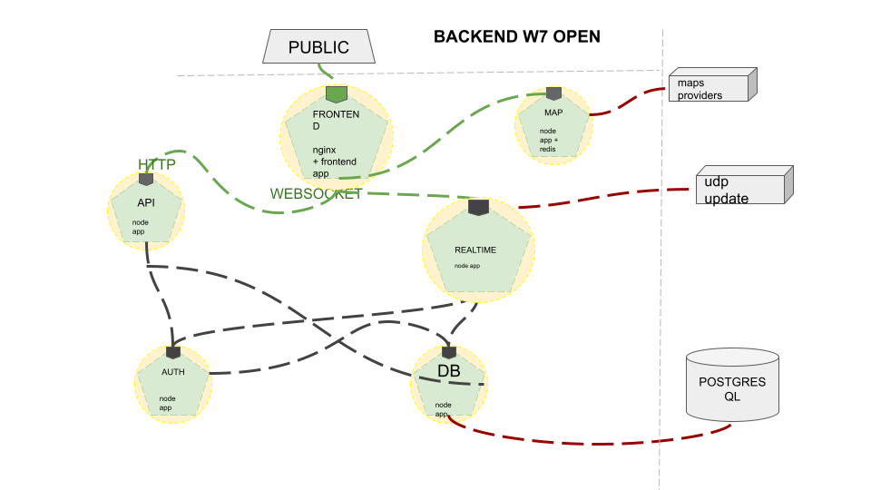

# W7

## Development Guide

- [guide](DevelopmentGuide.md)

## Database
- [database](Database.md)  

## File Configuration Database 
- [settings DB environment](setup/DBSettings.md)

## Backend

- Architecture   
  -   
- [microservices](Microservices.md)  
- [api](API.md)  

## Setup
- [setup](setup/System.md)

## Release
- [operation](Operation.md)

## W7 Meteo

- [Multi System](setup/MultiSystem.md)
- [Grants](microservices/grants.md)