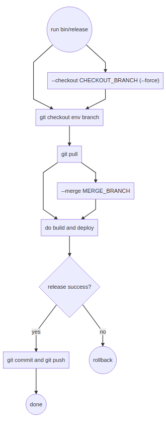

# W7 - Release

- [prepare local and server](setup/System.md)
- [prepare single microservice](setup/ReleaseMicroservice.md)

### Release a single microservice

To release a single microservice, inside its directory, run:

  - development

  ```bash
  sudo sys/release.js --server "\-i /home/user/keys/etg-w7-amazon.pem ubuntu@34.245.255.254" --env development
  ```

  - puglia-prod

  ```bash
  sudo sys/release.js --server "\-i /home/etguser/cert/ubuntu_w7_puglia etguser@192.168.55.165" --env puglia-prod
  ```

  - marche-prod

  ```bash
  sudo sys/release.js --server "\-i /home/etguser/cert/ubuntu_w7_marche etguser@88.57.232.46 \-p 7822 " --env marche-prod
  ```

Before release, you have to manually update each repository (usually by `git checkout branch`, `git pull` and so on).  


### Release all microservices

To release multiple microservices in one time, in `w7-release` directory run

  ```bash
  sudo bin/release.js --cwd [PATH]--server [SSH_LOGIN] --services [SERVICES] --env [ENV] --version-increment [INCREMENT] --checkout [CHECKOUT_BRANCH] --force --merge [MERGE_BRANCH] --merge-theirs --merge-ours --npm

  ```

  - `PATH` (mandatory) current working dir containing the repositories
  - `SSH_LOGIN` (mandatory) server ssh login; prompt will ask for password if required
  - `SERVICES` (mandatory) services to update: can be `all` or a comma separated list of services. Services are: `db`,`realtime`,`api`,`auth`,`map`,`frontend`
  - `ENV` (mandatory) environment to release (currently `development` or `prod`)
  - `INCREMENT` version increment for all services that are going to be released; level can be one of: `major`, `minor`, `patch`, `premajor`, `preminor`, `prepatch`, or `prerelease`; default is `prerelease`
  - `VERSION` set releasing version, ex. 1.2.3-beta; if set, `--version-increment` option will be ignored
  - `CHECKOUT_BRANCH` checkout all repositories to this branch
  - `--force` 'use force in `--checkout` **WARNING!!** uncommited changes will be deleted
  - `MERGE_BRANCH` merge from branch before release, for example release `master` after merge `development`
  - `--merge-theirs` use `"--strategy-option theirs"` on merge to resolve conflicts
  - `--merge-ours` use `"--strategy-option ours"` on merge to resolve conflicts
  - `--npm` perform `npm install` after pull

  **notes**
  `app-shell` follow all the rules above except for `merge`



  **examples**

  - update all services on 88.57.232.46 (prod) Sistema deploy ETG ( attenzione path certs )
  ```bash
  sudo bin/release.js --cwd /home/user/braceslab.com/customers/etg/w7 --server "etguser@88.57.232.46 \-p 7822 \-i /home/etguser/cert/ubuntu_w7_marche" --services all --env prod
  ```

 - release `db` and services on 192.168.55.165 
  ```bash
  sudo bin/release.js --cwd /home/etguser/etg/ --server "etguser@192.168.55.165 \-p 22 \-i /home/etguser/cert/ubuntu_w7_puglia" --services db --env puglia-prod 
  ```

  - release `auth` and `map` services on 34.245.255.254 (`development`), upgrading version by minor

  ```bash
  sudo bin/release.js --cwd /home/user/etg/w7 --server "ubuntu@34.245.255.254 \-i /home/user/keys/etg-w7-amazon.pem" --services auth,map --env development --version-increment minor
  ```

  ```bash
  sudo bin/release.js --cwd /home/user/etg/w7 --server "ubuntu@34.245.255.254 \-i /home/user/keys/etg-w7-amazon.pem" --services api,auth,db --env development
  ```

  - release `all` services on 34.245.255.254 env `development`

  ```bash
  sudo bin/release.js --cwd /home/user/etg/w7 --server "ubuntu@34.245.255.254 \-i /home/user/keys/etg-w7-amazon.pem" --services all --env development 
  ```

  - release `all` services on 34.245.255.254 env `development` merging `feature/x`

  ```bash
  sudo bin/release.js --cwd /home/user/etg/w7 --server "ubuntu@34.245.255.254 \-i /home/user/keys/etg-w7-amazon.pem" --services all --env development --force --merge feature/x --checkout feature/x
  ```

  - release `all` services on 34.245.255.254 env `beta` merging `development`

  ```bash
  sudo bin/release.js --cwd /home/user/etg/w7 --server "ubuntu@34.245.255.254 \-i /home/user/keys/etg-w7-amazon.pem" --services all --env beta --force --merge development --verson-increment minor
  ```

  - release `all` services on 34.245.255.254 env `release` merging `beta`

  ```bash
  sudo bin/release.js --cwd /home/user/etg/w7 --server "ubuntu@34.245.255.254 \-i /home/user/keys/etg-w7-amazon.pem" --services all --env release --force --merge beta --verson-increment major
  ```

#### Notes

**frontend**

For manual deploy of `frontend` microservice, you have to prepare your local environment as follow.  

- `app-shell` repository needs git submodules

```bash
cd app-shell
git submodule update --init 
git pull --recurse-submod
```

- install node.js and angular libraries

```bash
cd app-shell
sudo npm install --unsafe-perm=true
```

- build angular app (set env marche-prod)
```bash
sudo ng build --configuration=marche-prod 

```
- build angular app (set env puglia-prod)
```bash
sudo ng build --configuration=puglia-prod 

```

**https**  

Using Let'encrypt for https certificate, this has be reewed every 3 months.
Use crontab to run follow command (nb use the proper domain)

```bash
sudo docker run --rm -it \
      -v "/root/letsencrypt/log:/var/log/letsencrypt" \
      -v "/usr/share/nginx/html:/usr/share/nginx/html" \
      --mount type=bind,source=/etc/letsencrypt,target=/etc/letsencrypt \
      -v "/root/letsencrypt/lib:/var/lib/letsencrypt" \
      lojzik/letsencrypt certonly --standalone --agree-tos \
      -d dev-w7.braceslab.com --force-renewal
```

**CERTIFICATI WILDCARD** 
Se invece sono forniti certificati wildcard 
```bash
openssl pkcs12 -in regione.marche.it.pfx -out aa.key -nocerts -nodes 
openssl rsa -in aa.key -out aa_s.key 
openssl pkcs12 -in regione.marche.it.pfx -out aa.pem -nokeys -clcerts
aa_s.key and aa.pem sono i certificati validi
```

**MAP UTILITY** 
pre creare geojson da shpae files
mapshaper -simplify 50% -o format=geojson 

**CLEAR DOCKER SPACE when error during deploy** 
```bash
sudo docker image prune -a
```


