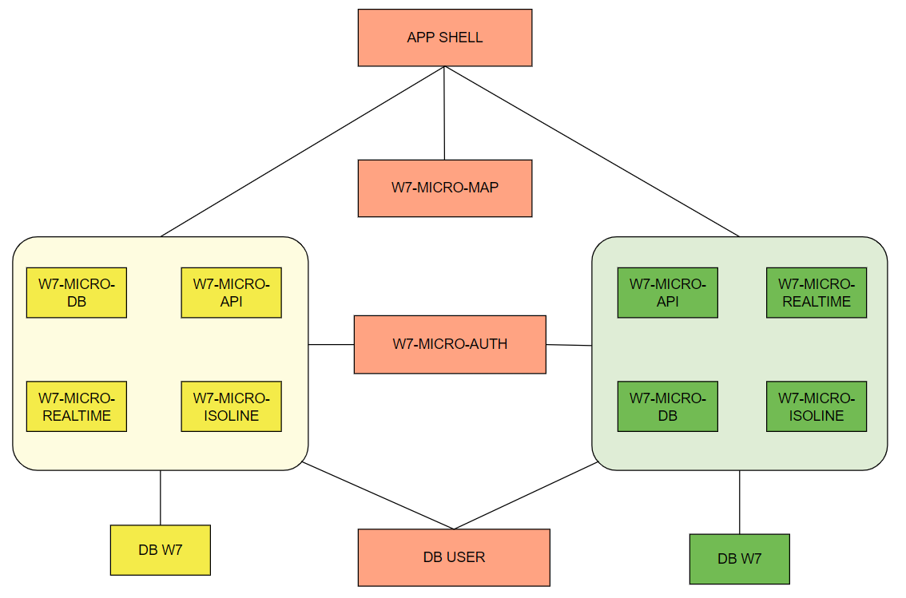

# W7 Meteo - Settings Multi System

## Configuration

Multi system works by adding specific microservices, with different paths and ports, to the W7 Meteo main system and routing to them with nginx. Need to choose one system as main system (which will be displayed as first on input selections and as the default system).
Microservices which need more then one configuration file `settings.js`, the main system follow the W7 Meteo's default configuration and the secondary system need to specific different paths and port of microservices.

In the following examples are used two system called `main` and `secondary`.

<div align="center"></div>

## Microservices settings

- [app-shell](#app-shell)

- [w7-microservice-db](#w7-microservice-db)

- [w7-microservice-api](#w7-microservice-api)

- [w7-microservice-realtime](#w7-microservice-relatime)

- [w7-microservice-isoline](#w7-microservice-isoline)

- [w7-microservice-frontend](#nginx) (nginx)

### APP-SHELL

- In `environemnt` specific the systems by `multiDb` like an array and put on first position the main system.

```json
{
    ...,
     multiDb: ['main', 'secondary'],
    ...
}
```

In this case will be displayed `Main` and `Secondary` as systems name.

### W7-MICROSERVICE-DB

- Each system need a configuration file `setting.js`. Main system use standard port

  `main.js`

  ```javascript
  settings.configUrl = '../configs/w7-micro-db-main'
  ```

  `secondary.js`

  ```javascript
  settings.configUrl = '../configs/w7-micro-db-secondary'
  settings.network.port = 9112
  ```

- Create files with <b>db's configuration</b>

  `w7-micro-db-main.js`

  ```javascript
  const db = {
    own: null,
    data: { v2: null },
  }
  db.data.v2 = {
    connection: {
      host: 'localhost',
      database: 'w7Main',
      user: 'admin',
      password: '****'
    }
  }
  db.own = {
    connection: {
      user: 'admin',
      host: 'localhost',
      database: 'w7User',
      password: '***'
    }
  }
  module.exports = db
  ```

  `w7-micro-db-secondary.js`

  ```javascript
  const db = {
    own: null,
    data: { v2: null },
  }
  db.data.v2 = {
    connection: {
      host: 'localhost',
      database: 'w7Secondary',
      user: 'admin',
      password: '****'
    }
  }
  db.own = {
    connection: {
      user: 'admin',
      host: 'localhost',
      database: 'w7User',
      password: '***'
    }
  }
  module.exports = db
  ```

### W7-MICROSERVICE-API

- Each system need a configuration file `setting.js`. Main system use standard port and path

  `main.js`
  ```
  settings.microservices.db.data.url = 'http://127.0.0.1:9110/v1'
  ```

  `secondary.js`
  ```
  settings.microservices.db.url = 'http://127.0.0.1:9112/v1'
  settings.microservices.db.data.url = 'http://127.0.0.1:9112/v1'
  settings.network.port = 9022
  settings.resources.path = '/secondary/api/v1'
  ```

### W7-MICROSERVICE-REALTIME

- Each system need a configuration file `setting.js`. Main system use standard port and path

  `main.js`

  ```
  settings.microservices.db.url = 'http://127.0.0.1:9110/v1'
  settings.microservices.api.url = 'http://127.0.0.1:9002/api/v1'
  ```

  `secondary.js`

  ```
  settings.microservices.db.url = 'http://127.0.0.1:9112/v1'
  settings.microservices.api.url = 'http://127.0.0.1:9022/api/v1'
  settings.realtime.port = 9011
  settings.network.port = 9102
  settings.udp.port = 9235
  settings.realtime.options.path = '/secondary/realtime'
  ```

### W7-MICROSERVICE-ISOLINE

- Each system need a configuration file `setting.js`. Main system use standard port and path

  `main.js`
  ```
  settings.microservices.db.url = 'http://127.0.0.1:9110/v1'
  ```

  `secondary.js`

  ```
  settings.microservices.db.url = 'http://127.0.0.1:9112/v1'
  settings.network.port = 9018
  settings.resources.path = '/secondary/api/custom/isoline'
  ```

### NGINX

- Like App-shell, there is only one settings file, where the main system has default routing for W7 Meteo and the secondary system has new routing. example:

```
location /secondary/api/v1/ {
	proxy_pass http://127.0.0.1:9022;
}
location /api {
	proxy_pass http://127.0.0.1:9002;
}
location /secondary/api/custom/isoline {
	proxy_pass http://127.0.0.1:9018;e
}
location /api/custom/isoline {
	proxy_pass http://127.0.0.1:9008;
}
location /secondary/realtime {
	proxy_pass http://127.0.0.1:9011;
}
location /realtime {
	proxy_pass http://127.0.0.1:9003;
}
```

### NOTES

- w7-microservice-map and w7-microservice-auth need only one settings file `setting.js`.
- Deploy microservices (api, realtime, db, isoline) with different environment, one with `main` and one with `secondary`